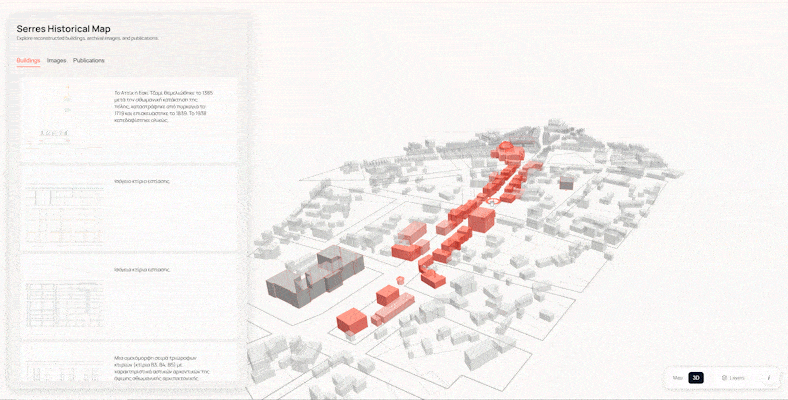

# Serres Historical Spatial Exploration Platform

The Serres Historical Spatial Exploration Platform is an interactive web application for exploring the historical urban landscape of Serres, Greece, through geospatial visualisation, archival material, and three-dimensional reconstruction.

---

## Overview

This project combines historical research, spatial data, and interactive visualisation to reconstruct parts of the Ottoman and early twentieth-century urban fabric of Serres.

The platform integrates archival photographs, reconstructed building footprints, scholarly publications, and three-dimensional models into a unified exploration environment. Users can investigate historical locations through both an interactive map and a synchronised 3D scene.

The application was developed by Athanasia Lantouri ([@lant96](https://github.com/lant96)) for F/8 Studio as part of the studio's work in digital cultural heritage, demonstrating how modern web technologies can support historical research, spatial storytelling, and public engagement with urban history.

**Live Demo**

https://map.f8studio.gr/


## Preview

Interactive exploration of the historical urban landscape through geospatial visualisation, archival material, and 3D reconstruction.



---


## Features

### Interactive Map

- Reconstructed historical building footprints
- Geolocated archival photographs
- Publication markers
- Interactive filtering and selection

### Three-Dimensional Exploration

- Reconstructed architectural models
- Orbit camera controls
- Synchronised interaction with the map view

### Relational Navigation

Each hotspot connects multiple types of historical information.

- Buildings
- Archival images
- Scholarly publications

Selecting an item automatically highlights all related entities across both visualisation modes.

### Detail Panel

Each hotspot provides:

- Historical descriptions
- Image galleries
- Related buildings
- Bibliographic references
- External publication links

---

## Project Structure

```
src/
├── app/
├── components/
├── services/
├── state/
└── views/
    ├── MapView/
    └── SceneView/

public/
├── data/
├── models/
└── draco/
```

---

## Tech Stack

- React
- Vite
- Mapbox GL JS
- Three.js
- React Three Fiber
- Zustand
- NocoDB

---

## Getting Started

```bash
npm install

npm run dev
```

---

## Research Context

The platform forms part of ongoing historical research conducted by **F/8 Studio** into the urban development of Serres during the Ottoman and early post-Ottoman period.

Historical reconstructions are based on archival maps, photographs, and published scholarship.

The project was presented at the **1st National Conference of Architects in Serres (2025)** under the title:

*Η οδός Μεραρχίας ως άξονας ιστορικής συνέχειας. Μία ψηφιακή προσέγγιση.*

The publication is available through Academia.edu:

[View publication on Academia.edu](https://www.academia.edu/171051744/%CE%97_%CE%BF%CE%B4%CF%8C%CF%82_%CE%9C%CE%B5%CF%81%CE%B1%CF%81%CF%87%CE%AF%CE%B1%CF%82_%CF%89%CF%82_%CE%AC%CE%BE%CE%BF%CE%BD%CE%B1%CF%82_%CE%B9%CF%83%CF%84%CE%BF%CF%81%CE%B9%CE%BA%CE%AE%CF%82_%CF%83%CF%85%CE%BD%CE%AD%CF%87%CE%B5%CE%B9%CE%B1%CF%82_%CE%9C%CE%AF%CE%B1_%CF%88%CE%B7%CF%86%CE%B9%CE%B1%CE%BA%CE%AE_%CF%80%CF%81%CE%BF%CF%83%CE%AD%CE%B3%CE%B3%CE%B9%CF%83%CE%B7?source=swp_share)

---

## Current Status

The platform is under active development, with historical content and reconstructed buildings being progressively expanded as research continues.

---

## Future Work

- Expand the reconstructed building collection.
- Improve spatial querying and filtering.
- Introduce temporal navigation between historical periods.
- Support additional archival collections.
- Extend the platform with richer historical storytelling tools.

---

## Rights

© 2026 F/8 Studio.

The source code, digital reconstructions, and original research content are the intellectual property of F/8 Studio. 

Access to certain assets, including 3D models and archival resources, may be restricted.

